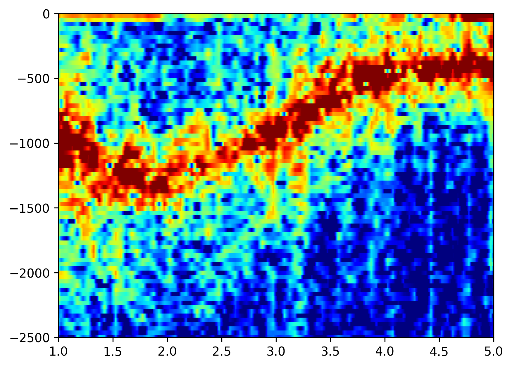
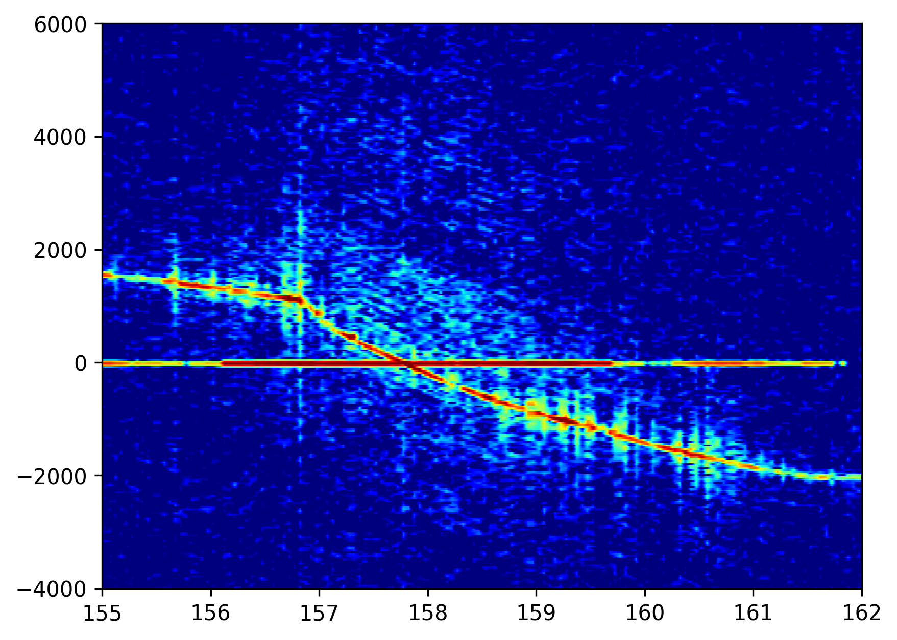
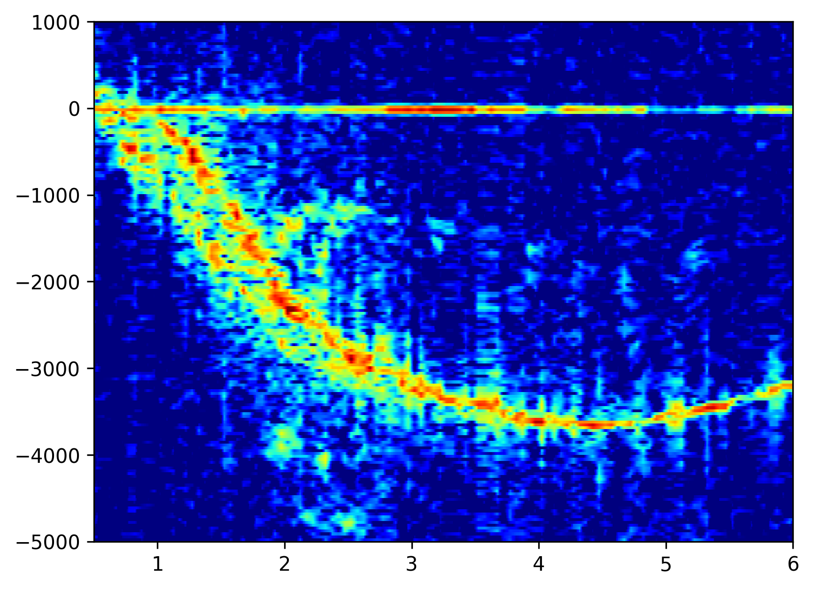
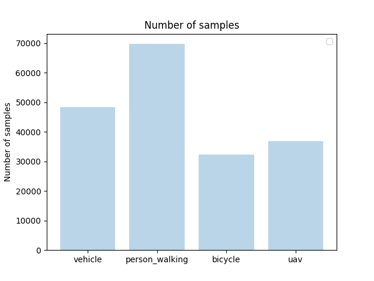
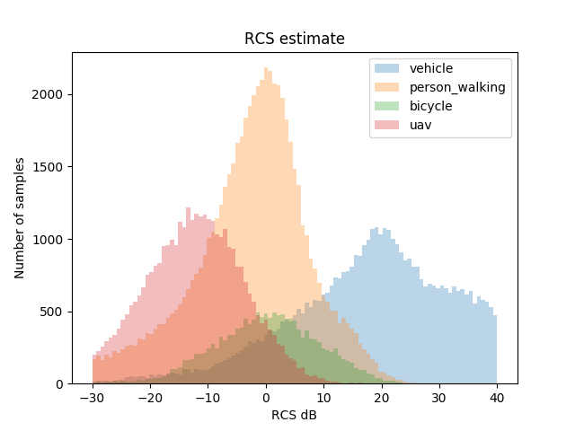
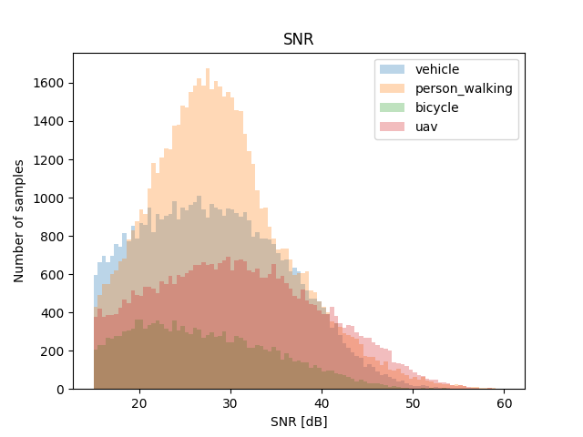
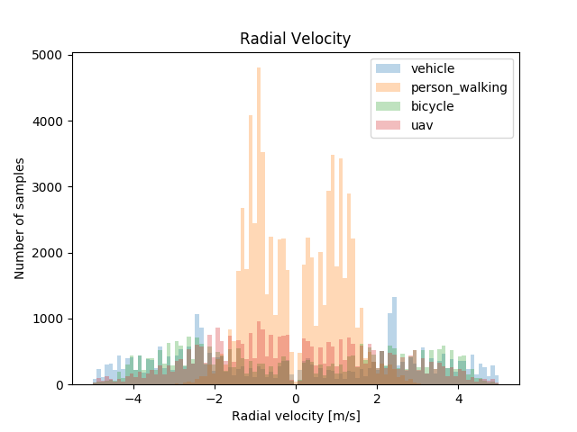

# Open Radar Datasets
Welcome to the github page for the "Open Radar Datasets", a part of the "Open Radar Initative". 
There are currently two datasets available;
- Outdoor Moving Object Dataset
- Assisted living dataset

## Outdoor Moving Object Dataset
This dataset is released under CC BY-NC 4.0 license. 
Attributions can be done by citing the paper as described below.

A dataset in a "ground surveillance" setting. 
The dataset has been collected with a stationary radar and targets moving in front of the radar. 
The dataset has been collected using both collaborative and non-collaborative targets. 

To load and view some samples of the datasets: 

[](https://colab.research.google.com/github/openradarinitiative/open_radar_datasets/blob/main/show_data.ipynb)[Open the datset in Google Colab](https://colab.research.google.com/github/openradarinitiative/open_radar_datasets/blob/main/show_data.ipynb)

### Samples: 
Person walking             |  Person bicycling
:-------------------------:|:-------------------------:
  |  
UAV sample             |  Vehicle sample
  |  

### Dataset statistics:

Number of samples             |  RCS estimate
:-------------------------:|:-------------------------:
  |  
SNR             |  Radial Velocity
  |  

### Dataset content
The dataset is a a python dictionary and primarily contains _doppler spectra_, but there is also some other information that might be useful.
The ".npy" file contains a dictionary of _signatures_, each _signature_ corresponds to a full radar-track and contains again contains:
| Field name        | Explanation    |
| ------------- |:-------------:|
| signature  |  Numpy array of the doppler spectra for that track|
| ts         |  Timestamp for each spectra|
| range      |  Measured range for the detection|
| azimuth    |  Measured azimuth for the detectin|
| velocity   |  Measured radial velocity|
| snr_db     |  Estimated SNR in dB, estimated from a 1D CFAR|
| x          |  Kalman-filtered x-position|
| y          |  Kalman-filtered x-position|
| z          |  Kalman-filtered x-position|
| class_name |  Class name string|
| radar_parameters |  Dict with the radar parameters|

The _radar_parameters_ dict contain sensor and waveform-specific parameters

| Field name        | Explanation    |
| ------------- |:-------------:|
| num_range_bins |  Number of range bins|
| num_pulses |  Number of pulses in each frame|
| num_antenna_elements |  Number of receiver elements sampled|
| fc |  Center frequency|
| bw |  Sampled Bandwidth|
| prf |  PRF|
### Citation
To attribute this dataset for you own use, please cite this paper:
```
@INPROCEEDINGS{Gusland,
author = {Gusland, Daniel and Christiansen, Jonas M and Torvik, B{\o}rge and Fioranelli, Francesco and Ritchie, Matthew},
booktitle={2021 IEEE International Radar Conference (RADAR)}, 
title = {{Open Radar Initiative : Large Scale Dataset for Benchmarking of micro-Doppler Recognition Algorithms}},
year={2021},
}

```
